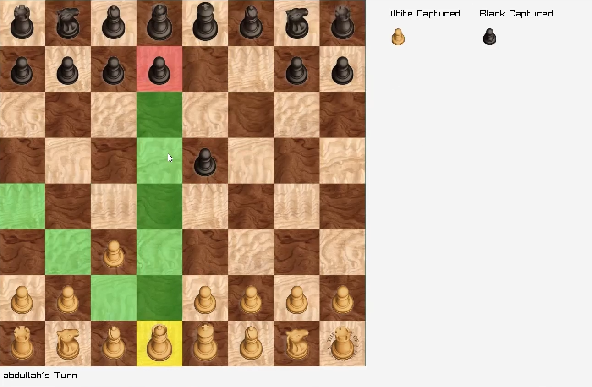

# ♟️ Chess Variants Collection

This repository contains three versions of a complete chess game, developed across different stages of my university coursework. Each version implements **all standard chess rules**, including castling, en passant, pawn promotion, and check/checkmate detection.

## 📁 Project Structure

- `01_Programming_Fundamentals/`  
  A basic console-based chess game built using procedural programming principles.

- `02_Object_Oriented_Chess/`  
  An improved version using Object-Oriented Programming (OOP) concepts for better structure and maintainability.

- `03_GUI_Chess_Raylib/`  
  A feature-rich GUI chess game developed using **Raylib**. This version extends the OOP version and includes an interactive graphical interface.

## 🎯 Features (all versions)
- Full chess rules implemented
- Two-player gameplay
- Valid move enforcement
- Game state tracking (check, checkmate, stalemate)

## 🛠 Technologies Used
- C++ (All versions)
- Raylib (GUI version)

---

## 📌 Note
These projects were developed as part of my coursework for:
- **Programming Fundamentals**
- **Object-Oriented Programming (OOP)**

